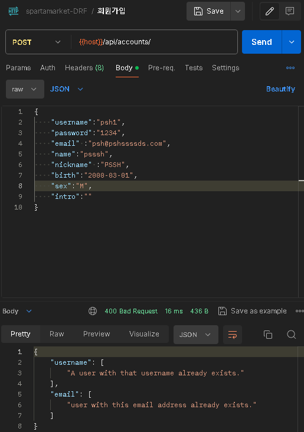
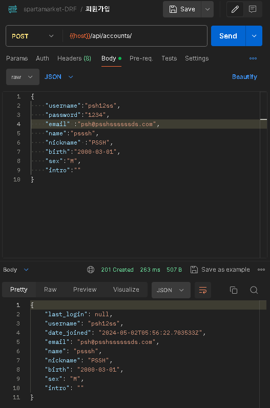
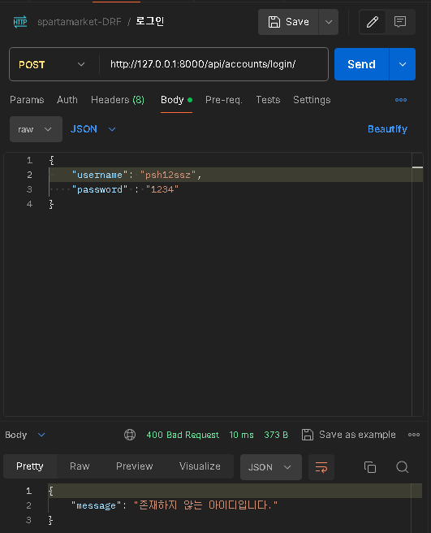
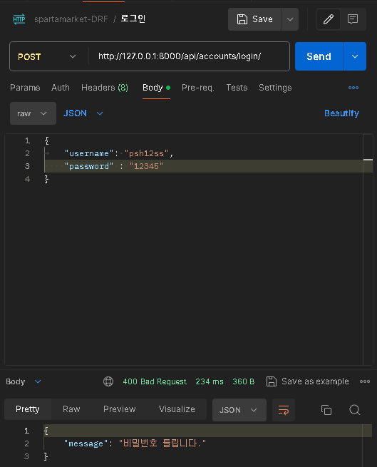
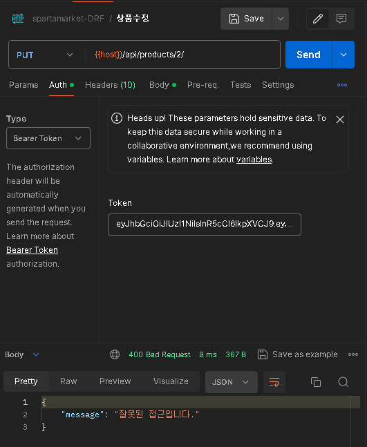

# spartamarket-DRF
### 프로젝트명 : 우리를 위한 중고거래(스파르타 마켓)

   
  
   

 

## 프로젝트 소개
### 우리가 아는 'ㄷㄱ' 홈페이지의 백엔드를 DRF를 사용하여 CRUD를 구현한 프로젝트
### 프로젝트 기간 : 2024.04.26 ~ 2024.05.02(7일)
 

## 기술 스택

| [Django](https://docs.djangoproject.com/ko/4.2/) | [Python](https://docs.python.org/ko/3.8/) |  [SQLite3](https://www.sqlite.org/docs.html)   
| :--------: | :--------: | :------: |
|       |       |  

## ERD

   
  
   

 

## 구현 기능
### ACCOUNT
- 회원가입

<figure>

<figcaption>username, email이 이미 존재한 경우</figcaption>
 

<figcaption>성공한 경우</figcaption>
</figure>

- 로그인

<figure>

<figcaption>usernaem 없는 경우</figcaption>
 

<figcaption>비밀번호 없는 경우</figcaption>
 

<figcaption>성공한 경우</figcaption>
</figure>

- 프로필 조회

<figure>

<figcaption>다른 사람이 접근한 경우</figcaption>
 

<figcaption>본인이 접근한 경우</figcaption>
</figure>

- 회원탈퇴

<figure>

<figcaption>다른 사람이 접근한 경우</figcaption>
 

<figcaption>본인이 접근한 경우</figcaption>
 

<figcaption>비밀번호 틀린 경우</figcaption>
</figure>

### PRODUCT
- 상품등록

<figure>

<figcaption>로그인한 사람 상품등록 완료</figcaption>

- 상품조회

<figure>

<figcaption>물품 5개씩 페이지네이션</figcaption>

- 상품수정

<figure>

<figcaption>다른사람 접근한 경우</figcaption>
 

<figcaption>본인 접근한 경우</figcaption>

- 상품삭제

<figure>

<figcaption>다른사람 접근한 경우</figcaption>
 

<figcaption>본인 접근한 경우</figcaption>

## API

 

## PIP LIST
- requirements.txt 파일을 참고